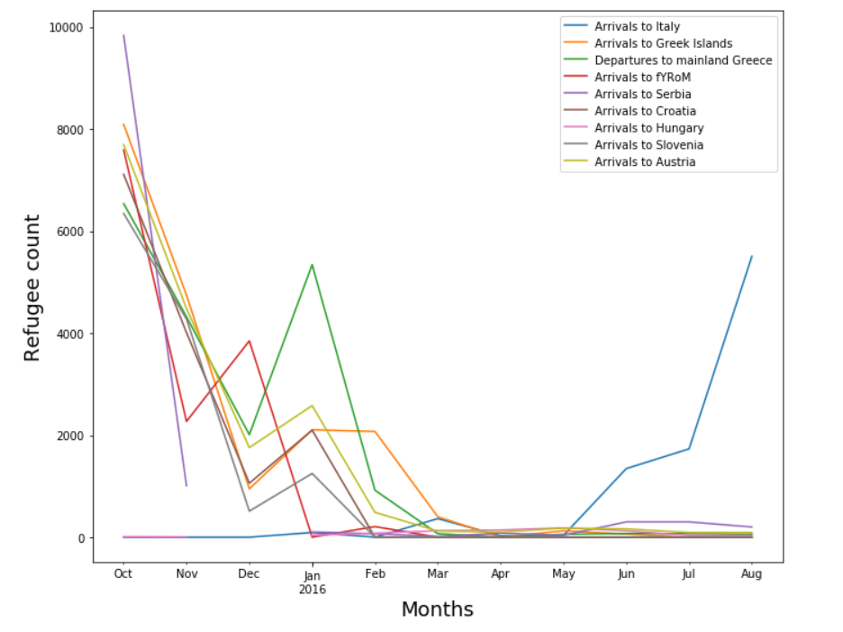

# Time-Series-Analysis

```
 IDE: Jupyter Notebook 
 Language: Python 3 
```

Different Time series analysis techniques are applied and the best model is selected for predicting the refugee count for the future upcoming days. Additionally, our forecasting model is also used to answer the following research questions.

- How is the preferred destination for the refugees being
affected by the changes in the total number of refugees
travelling through theWestern balkan route and how closely
are both the time series related to each other?

- We would like to explore the correlation among the countries.
The detailed explanation would be, for instance, if
there exist a correlation between Arrivals to Greek Island
and Mainland Greece during a certain period of time then
would the same correlation exists in the future also.


### About the Data:
The data set gives the information about the refugees arriving at various European countries such as Serbia, Italy, Hungary, Croatia,
Slovenia, Austria, Greece, and the Greek Islands. Dataset has
the counts of refugees starting from October 2015 to September
2016 and same can be used to create a forecasting model in order
to predict refugee inflow to a particular country.

### Visualization of the Data:



## Note: 
1. Since Github has an issue in displaying .ipynb files here, please paste the project link by navigating to the following URL: https://nbviewer.jupyter.org/ 

2. The other option is to clone the repository to the local drive and load it in a Jupyter Notebook.


